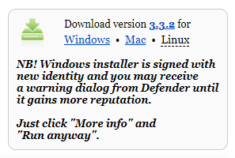

## تثبيت Sonic Pi على Raspberry Pi

- تم تثبيت Thonny بالفعل على نظام Raspberry Pi OS ، ولكن قد تحتاج إلى التحديث إلى أحدث إصدار
- افتح نافذة طرفية ، إما عن طريق النقر فوق الرمز الموجود في الزاوية العلوية اليسرى من الشاشة أو بالضغط على مفاتيح Ctrl + Alt + T في نفس الوقت
- في النافذة ، اكتب ما يلي لتحديث نظام التشغيل و Thonny

```bash
sudo apt update && sudo apt upgrade -y
```

## تثبيت Thonny على أنظمة التشغيل الأخرى

- في أنظمة التشغيل Windows و macOS و Linux ، يمكنك تثبيت أحدث إصدار من Thonny IDE أو تحديث إصدار موجود
- في متصفح الويب , انتقل الى [Thonny.org](https://thonny.org/){:target="_blank"}
- في الزاوية العلوية اليمنى من نافذة المتصفح ، سترى روابط التنزيل لنظامي التشغيل Windows و macOS ، وإرشادات لنظام التشغيل Linux
- قم بتنزيل الملفات ذات الصلة وتشغيلها لتثبيت Thonny



## افتح Thonny

افتح Thonny من مشغل التطبيق الخاص بك. يجب أن يكون لديك شيء كهذا:


يمكنك استخدام Thonny لكتابة كود Python القياسي. اكتب ما يلي في النافذة الرئيسية ، ثم انقر فوق زر **التشغيل** (سيُطلب منك حفظ الملف).

```python3
print('Hello World!')
```
