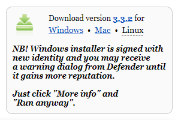
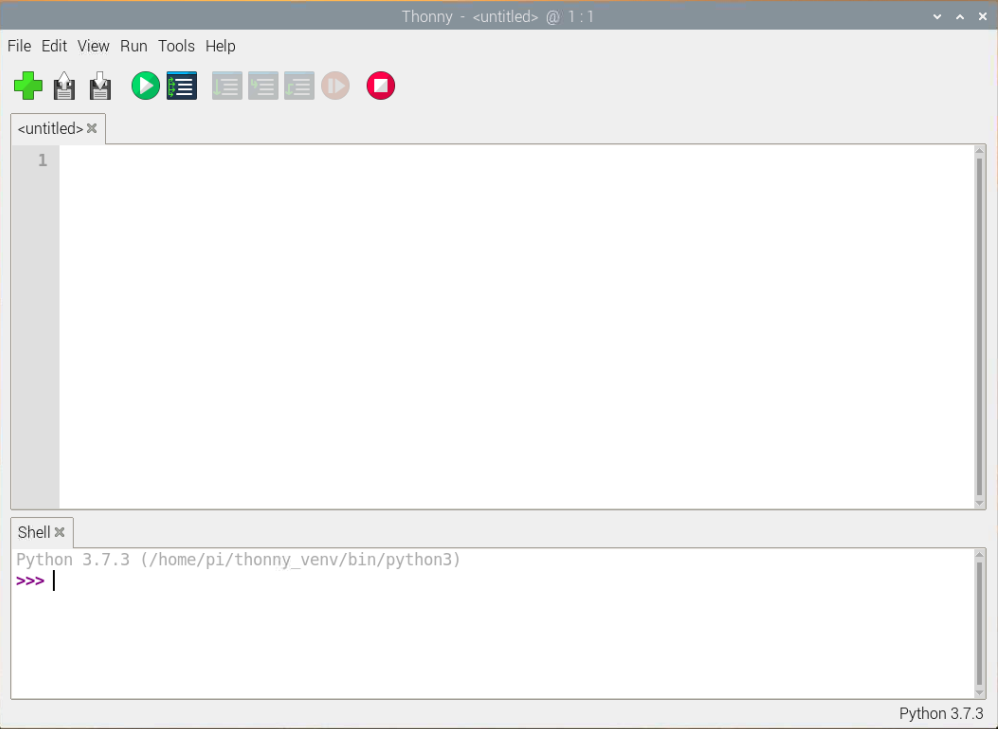

## Instalace editoru Thonny na Raspberry Pi

- Thonny je již nainstalován na operačním systému Raspberry Pi OS, ale může být nutné jej aktualizovat na nejnovější verzi
- Otevři okno terminálu buď kliknutím na ikonu v levém horním rohu obrazovky, nebo současným stisknutím kláves Ctrl+Alt+T
- V okně zadej následující příkaz pro aktualizaci operačního systému a Thonny

```bash
sudo apt update && sudo apt upgrade -y
```

## Instalace editoru Thonny na jiné operační systémy

- V systémech Windows, macOS a Linux si můžeš nainstalovat nejnovější Thonny IDE nebo aktualizovat stávající verzi
- Ve webovém prohlížeči přejdi na [thonny.org](https://thonny.org/){:target="_blank"}
- V pravém horním rohu okna prohlížeče uvidíš odkazy ke stažení pro Windows a macOS a pokyny pro Linux
- Stáhni si příslušné soubory a spusť je pro instalaci editoru Thonny



## Otevření Thonny

Otevři Thony ze spouštěče aplikací. Mělo by to vypadat nějak takto:



Thonny lze použít k psaní standardního kódu v Pythonu. Do hlavního okna zadej následující příkaz a poté klikni na tlačítko **Spustit** (budeš vyzván k uložení souboru).

```python3
print('Hello World!')
```


