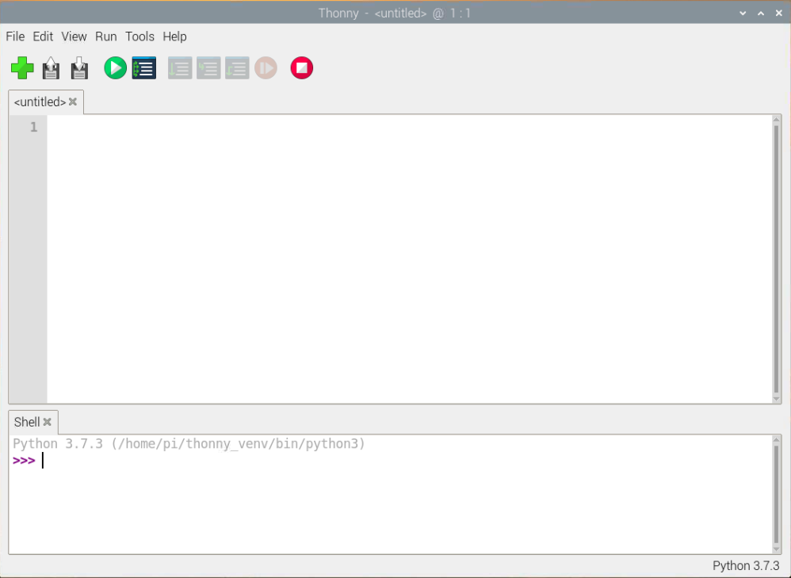

## Εγκατάστησε το Thonny σε ένα Raspberry Pi

- Το Thonny είναι ήδη εγκατεστημένο στο Raspberry Pi OS, αλλά ίσως χρειαστεί να αναβαθμιστεί στην πιο πρόσφατη έκδοση
- Άνοιξε ένα τερματικό παράθυρο, είτε κάνοντας κλικ στο εικονίδιο στην επάνω αριστερή γωνία της οθόνης είτε πατώντας τα πλήκτρα Ctrl+Alt+T ταυτόχρονα
- Στο παράθυρο, πληκτρολόγησε τα παρακάτω για να ενημερώσεις το λειτουργικό σύστημα και το Thonny

```bash
sudo apt update && sudo apt upgrade -y
```

## Εγκατάστησ το Thonny σε άλλα λειτουργικά συστήματα

- Στα Windows, macOS και Linux, μπορείς να εγκαταστήσεις το πιο πρόσφατο Thonny IDE ή να ενημερώσεις μια υπάρχουσα έκδοση
- Σε ένα πρόγραμμα περιήγησης ιστού, πήγαινε στη διεύθυνση [thonny.org](https://thonny.org/){:target="_blank"}
- Στην επάνω δεξιά γωνία του παραθύρου του προγράμματος περιήγησης, θα δεις συνδέσμους λήψης για Windows και macOS και οδηγίες για Linux
- Κατέβασε τα σχετικά αρχεία και εκτέλεσέ τα για να εγκαταστήσεις το Thonny


## Άνοιγμα Thonny

'Ανοιξε το Thonny από το πρόγραμμα εκκίνησης της εφαρμογής σου. Θα πρέπει να μοιάζει κάπως έτσι:



Μπορείς να χρησιμοποιήσεις το Thonny για να γράψεις τυπικό κώδικα Python. Πληκτρολόγησε τα ακόλουθα στο κύριο παράθυρο και, στη συνέχεια, κάνε κλικ στο κουμπί **Εκτέλεση** (θα σου ζητηθεί να αποθηκεύσεις το αρχείο).

```python3
print('Γεια σου Κόσμε!')
```


