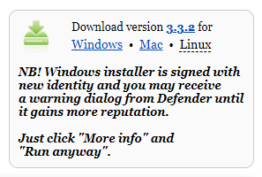

## Installer Thonny sur un Raspberry Pi

- Thonny est déjà installé sur Raspberry Pi OS, mais peut nécessiter une mise à jour vers la dernière version
- Ouvre une fenêtre de terminal, soit en cliquant sur l'icône en haut à gauche de l'écran, soit en appuyant simultanément sur les touches Ctrl+Alt+T
- Dans la fenêtre, tape ce qui suit pour mettre à jour ton système d'exploitation et Thonny

```bash
sudo apt update && sudo apt upgrade -y
```

## Installer Thonny sur d'autres systèmes d'exploitation

- Sous Windows, macOS et Linux, tu peux installer le dernier Thonny IDE ou mettre à jour une version existante
- Dans un navigateur Web, accède à [thonny.org](https://thonny.org/){:target="_blank"}
- Dans le coin supérieur droit de la fenêtre du navigateur, tu verras des liens de téléchargement pour Windows et macOS, ainsi que des instructions pour Linux
- Télécharge les fichiers pertinents et exécute-les pour installer Thonny



## Ouvrir Thonny

Ouvre Thonny depuis ton lanceur d'applications. Ça devrait ressembler a quelque chose comme çà :


Tu peux utiliser Thonny pour écrire du code Python standard. Tape ce qui suit dans la fenêtre principale, puis clique sur le bouton **Exécuter** (tu seras invité à enregistrer le fichier).

```python3
print('Hello World!')
```


